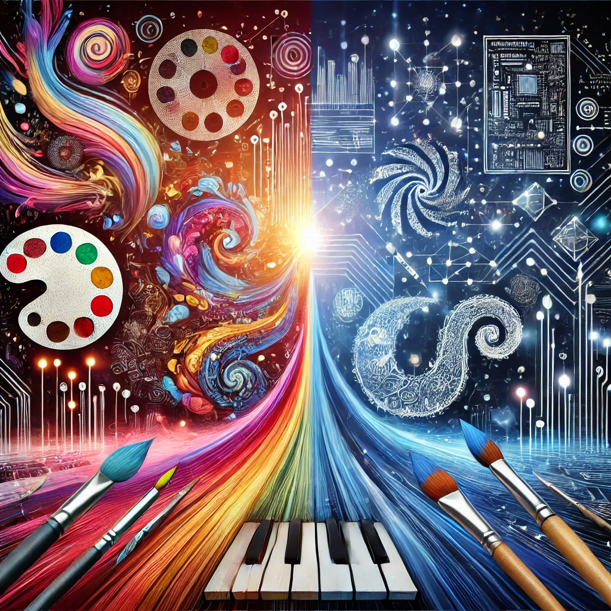

  
  
Source: DALL·E

  Everyone likes to point out the technical or mathematical concepts in art whether it is through symmetrical proportions, geometric shapes, or even the process of generating computer graphics. But what benefits do the arts and creative mindset have to offer in return? This is the primary query I would like to answer for myself as I proceed through my personal journey of learning software engineering. As a creative myself, computer science has always intrigued me in terms of abstract problem solving and pattern recognition. Although many aspects of coding are well established and immutable, I believe that thinking outside the box provides a plethora of different techniques to approaching software engineering.
 
  The human psyche operates in wondrous ways where certain visual cues appear more aesthetic or pleasant than others. Software engineering is comparable to designing a building whereas the materials that make up said structures are computer programs instead. However, creating a building from scratch requires a certain vision first and that is where architects come into the picture. I would like to apply a similar process of this as an artist to software development. One particular characteristic of software engineering that I want to expand upon is the concept of user interface (UI) and user experience (UX) design. Although the saying goes “don’t judge a book by its cover”, our natural instinct as a human is to detect the visual enjoyment we receive from viewing something. How someone reacts to a website or app design is crucial in consistent usability and navigation. Of course the application itself would have to be functional first before getting into the nitty gritty details of looks. What I would like to take away from software engineering is how function can be improved through aesthetics. Another real world application of this would be through data visualization. Oftentimes, scientists or even the public prefer to see a chart or other informational graphic of data instead of an intimidating grouping of numbers and letters. Through software development in combination with the arts, this is very achievable and I would like to understand how.
  
  Even in this modern age of technology where artificial intelligence (AI) is able to generate both artistic images and legible code, there still room to improve upon in terms of the coordination of the two. Learning how to structure computer programs in a concise, functional, and stable way to the average user is a very important skill I want to achieve. As we continue to live in such a digital age, the possibilities are ever growing and endless. If there is a way in which I can learn this while incorporating graphical design elements and creative thinking into the process of software engineering, then it is highly ideal for me to explore such topics at this point in my academic career. 
