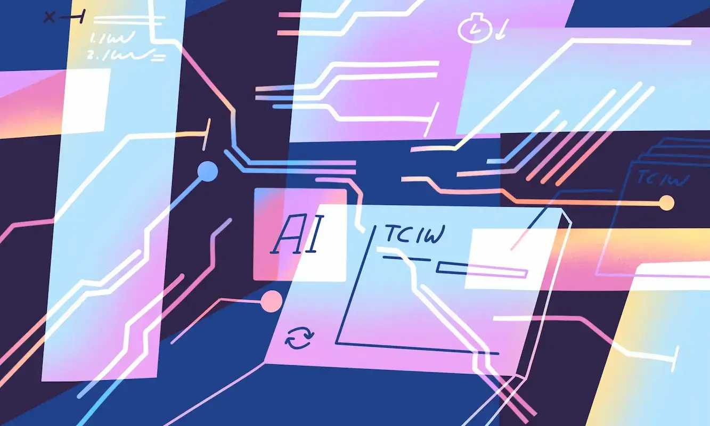

<div style="text-align: center;">
  
  <p style="margin-top: 10px;">Source: Aqua-Cloud</p>
</div>

<hr>

## AI’s Role in Education and ICS 314
With the growing popularity and exponential improvement of AI within recent years comes its various usages especially its application in the educational institutes. ICS 314 is the first computer science course that I have taken that openly encourages students to implement AI into their learning experiences. While other departments might view assisted learning as “cheating” in their respective fields, this class has shown me how AI can have both advantages and disadvantages in its role of teaching. In terms of software engineering specifically, I have mainly found AI to be useful when it comes to fixing bugs and syntax but a hindrance when fine tuning to software design patterns or design frameworks. Throughout this course, I mainly utilized ChatGPT to assist in my learning and the findings from my own experience range on a wide spectrum of helpfulness.

## Using AI Selectively
Although a good portion of AI-users tend to incorporate ChatGPT in their writing in order to improve their vocabulary and grammar mistakes, I strictly strayed away from this usage. The essays that were assigned centered around personal opinion and experience about given topics so I found it to be ironic if I were to ask an AI to voice my concerns for me if I can articulate my own thoughts. The times when I did use AI was usually during practice WODs but the results were not always favorable or accurate. For one of the Jamba Juice WODs, I asked ChatGPT to write a function that updates the ingredient inventory whenever a smoothie is sold where each smoothie has a list of ingredients and their required amounts. It gave me a function that looped through the ingredients and subtracted the amounts directly from an inventory object. 
```
function updateInventory(smoothieName: string) {
  const recipe = recipes[smoothieName];
  for (const ingredient in recipe) {
    inventory[ingredient] -= recipe[ingredient];
  }
}
```
But in my app, the inventory was actually an array of ingredient objects, not a key-value pair object. I didn’t notice the mismatch at first, so when I tried using the function, nothing worked as intended.

## The Mixed Impact of AI
Personally, I am not quite sure if I can verify the helpfulness of AI in my software engineering learning experience. To be completely honest and fair to myself, I would usually use ChatGPT as a last resort when I know I have exhausted all my other resources. When it comes down to comprehension and developing skills, ChatGPT would often help me break down complex concepts especially when I was learning array constructs and how to go about functional programming. I also used it to help with formatting in Typescript and ESLint as they require specific syntax. When it came down to logical errors and putting everything together however, I would rely on AI to fix it for me which may have been a hindrance in the long run. At times when I would receive answers from ChatGPT, I think that I would have been able to solve the problem myself had I spent more time on the lessons. Even though I was able to figure out what each specific function does, using AI prevented me from being able to understand how each aspect interacted with each other. 

## AI’s Expanding Influence
As stated earlier, there has been a prominent rise in the use of artificial intelligence throughout different levels of schooling. Its severity of effects on the youth has been heavily debated as new anti-AI technology is developed to combat issues of cheating and plagiarism. Outside of educational institutions, AI offers a variety of applications for other industries as well. For example, creative media and animation utilizes a lot of repetitive and tedious imagery in order to illustrate fluid motions. Within recent productions, big name companies like Disney have adopted AI technology in films such as Big Hero 6 and Zootopia for things like crowd simulation, background generation, lip syncing, etc. In the realm of software engineering, AI has other practical uses such as Facebook’s TransCoder, a ML system that can translate code from one language to another with high percentages of accuracy. As artificial intelligence and its prevalence in the world continues to expand, it is important that we heavily moderate it for adverse reactions. 

## Limitations in Design and Visual Tasks
Throughout the duration of this course I found AI to be a nuisance especially when dealing with specific visual styles and code composition. During in class WODs that centered around HTML, CSS, React, and Next.js, I found out that ChatGPT is not really optimized for handling design choices. When we were tasked with recreating the Kō Hana Rum website in different formats, the AI would often get the padding, margins, and placements wrong. However, I do believe that AI still offers great benefits for software engineering students as it can tailor material to individual students’ skill levels, learning styles, and progress in a flipped classroom environment. Another way a computer scientist student can take advantage of AI is by having the MLM help generate edge cases and unit tests to their programs. This way, they can identify crucial mistakes in their code and learn how to optimize them better for different real world scenarios. 

## A Tool for Personalized and Instant Learning
Everyone has a different learning style and tolerance of focus no matter what teaching method is being used. The main difference between traditional learning and assisted learning is that nowadays AI can cater to specific thought processes and styles of information absorption. This way of personalized learning can help keep students more engaged if they prefer that over classic lectures with powerpoint slides. Artificial intelligence also provides conveniency as these sources of information are available 24/7 when interaction between students and instructors can be limited. For software engineering education and many other fields of computer science, code evaluation can be time consuming as each individual operates diversely. With AI, students are able to automatically receive immediate feedback without biases and preferences. While AI enhances speed, feedback, and personalization, traditional methods still provide human mentorship, structured thinking, and ethical context that AI cannot fully replicate. It can not be a direct substitute for traditional learning but rather a tool to boost its effectiveness instead. 

## Over-Reliance and Ethical Considerations
Reiterating my points from before, I do think AI and its role in assisted learning can be helpful but only after careful consideration. If students become too dependent on artificial intelligence, this could create an over-reliance on these tools and prevent them from intellectually challenging themselves to grasp the material. Instead of taking the time to gain problem solving skills and foundational knowledge, it hurts them in the future when they have to re-learn all the concepts again when their teaching was automated in the first place. AI can also blur the line between assistance and cheating so educators should know when to use it in their curriculum that minimizes the risk of plagiarism. Future classrooms should involve both AI and human mentorship in education as they can become compliments to each other. Its widespread use is inevitable but with monitored control and a blend of traditional methods, it will ensure a more receptive and successful response in education. 

## Integrating AI Responsibly
Reflecting on my experience in ICS 314, I've come to see AI as a double-edged sword in software engineering education. My reliance on AI as a last resort helped prevent total dependency, but it also revealed how easily one could miss out on developing strong foundational skills if used without restraint. Moving forward, I believe AI should be integrated more intentionally to be used as a supplement rather than a shortcut. Teachers and instructors should guide students on when and how to use these tools effectively, emphasizing problem-solving and critical thinking first. A balanced combination of mentorship and AI support could help students gain the most from both worlds.
