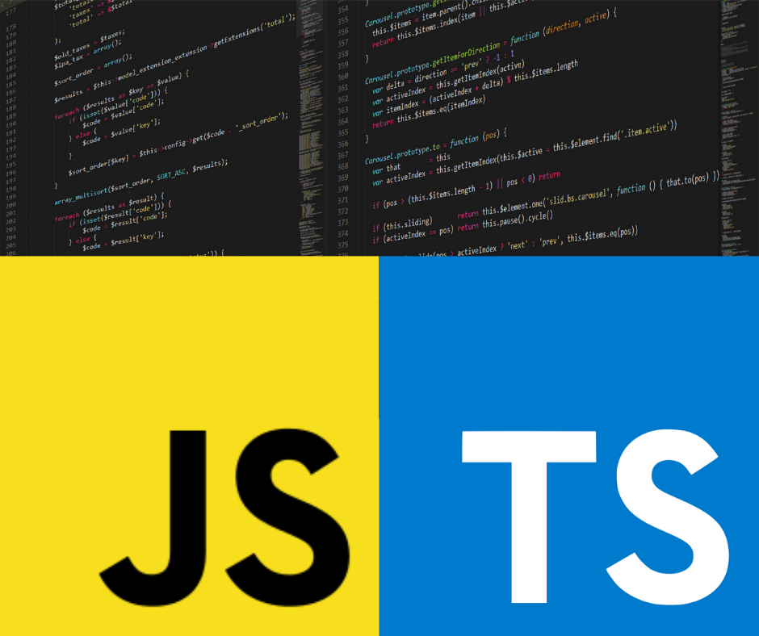

<div style="text-align: center;">
  
  <p style="margin-top: 10px;">Source: ITNext</p>
</div>

<hr>

When learning a new coding language, oftentimes than not, a person is absorbing an entirely new set of vocabulary and syntax where they have to shift between equivalent statements of each other. However in the experience of learning Typescript, it became more of a helpful extension rather than a completely new language in itself. Since Typescript is a superset of Javascript, educating myself on Typescript was a very straightforward and easy process. Much similar to how C++ is an addition to C, Typescript provided the same mechanics as Javascript but much more advanced features and clearer organization due to its static typing abilities.

From a software engineering standpoint where one is creating a program for a set of ideas from scratch, Typescript in my experience provides many advantages compared to Javascript. Since Typescript incorporates static typing, the process of explicitly stating that a variable is a number, string, boolean, etcetera, this provides a clearer understanding of the values of data that is being passed around. This comes in handy especially when one is testing their program for certain errors where a desired output is being shown.
Here are two sets of code that function similarly in Javascript:

```
function calculateSquare(num) {
    // Intended to return a number, but accidentally returns a string
    return "The square is " + (num * num);
}

const result = calculateSquare(5);

// You expect a number, but you get a string instead
console.log(result * 2); // NaN (because result is a string, not a number)
```
In Typescript:
```
function calculateSquare(num: number): number {
    // Compiler enforces that the return type must be a number
    return "The square is " + (num * num); // Error: Type 'string' is not assignable to type 'number'
}

const result = calculateSquare(5);

// You cannot even compile the code due to the type mismatch error
console.log(result * 2); // This line won't execute because of the earlier error
```
In this particular example, Typescript is able to capture the errors during compilation and will not execute certain parts of code due to mismatching types. In comparison to Javascript, since it is dynamically typed the program will not explicitly check for return types and will behave in unexpected ways. To a novice coder like me, these differences may not have captured my eye at first glance but now as I continuously practice Typescript more, I can clearly see the benefits it has by being a more strict and specific language.
	
While most of the material in learning Javascript and Typescript are done in a flipped classroom environment to encourage in class exercises, I find this strategy to have its advantages and disadvantages. Athletic software engineering, in other words timed practice problems, forces me to think abstractly under pressure. If I were to do the same at home on my own time, I would not necessarily feel the same rigor and satisfaction of completing the task on time while being surrounded by my peers. Practice WODs, workouts of the day, provide me with a sense of real-world applications as many careers in the computer science industry have stern deadlines to adhere to. However, the main feedback I have for a flipped classroom environment is how much material a student may need to go through. Depending on the pace of the modules and how much assignments are required, some students may not have the discipline or time to dedicate themselves to fully learning such concepts. Personally, I learn much more efficiently in a lecture class environment but I can see the pros and cons of both methods. However an institute chooses to educate their students through a certain curriculum can be up in the air. It is ultimately down to the individual themselves on how they want to utilize the strategies being given to them to their fullest potential and extent like how I intend to do.

