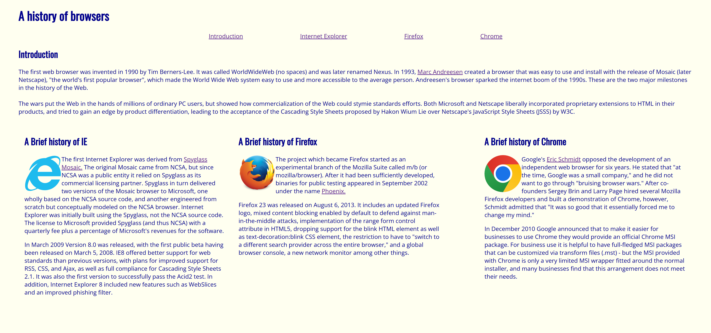
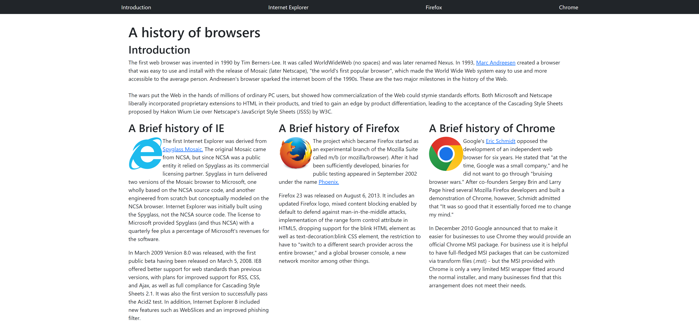

<div style="display: flex; justify-content: center; gap: 20px; align-items: center; flex-wrap: wrap;">
  
  
</div>
<p style="text-align: center; margin-top: 10px;">Left: Raw HTML/CSS, Right: Bootstrap 5</p>

<hr>

## The Power of Tools in Everyday Life
Every day of our lives, we are constantly using a plethora of tools that lets us complete tasks more efficiently. Whether taking an elevator over stairs or using your phone for navigation and GPS, the world revolves around finding ways to make our lives easier. This same principle applies to how UI frameworks like Bootstrap 5 are simply advantageous tools for software engineers in the web development process. Imagine that you are constructing a house from scratch. You wouldn’t want to build each individual furniture item yourself as that would require much more extra work than needed. Instead of customizing everything, pre-made furniture is purchased and time is saved while each item remains cohesive with one another. UI frameworks achieve the same outcome by providing web developers with a variety of common presets that would otherwise be manually created every time. This is why many websites share similar formatting and structuring. 

## Downsides of UI Frameworks
Some may argue that UI frameworks are a whole new coding language to learn in itself as they may incorporate complex documentation for all of the new features. In addition, a lot of frameworks include unnecessary code that may bloat the website and can cause it to perform slower. While it may be true, this view negates the fact that looking for a specific class to suit your needs requires much less effort than if you were to use raw HTML and CSS. For design purposes, a site should look clean and minimal for optimal experiences so the extra code should not have too large of an impact. Although frameworks provide a consistent and aesthetic template, others may argue against it as they create a generic design. This would only be proven to be an issue if the software engineer leaves it as the default without any customization, which is bad practice in general and can easily be altered now that you have a base to work with. 

## UI Frameworks are Web Dev Shortcuts
Two identical websites may look and operate in the same manner whether it was composed of raw HTML/CSS or through a UI framework. The key differences between the two lie behind the scenes within the writing of the code. As mentioned earlier, frameworks such as Bootstrap 5 save a lot of development time as it has pre-made components you can use without needing to make them yourself. Take for example in the pictures provided above, a simple website made with only raw HTML/CSS and the other using Bootstrap. While the two websites are structured similarly with the 3 main middle columns, the method in which they were written differs. On the left with the pure HTML/CSS, I had to manually create classes for the left, right, and middle sections with each of them having unique values for the variables.
```
.left {
    width: 30%;
    float: left;
    padding: 1em;

}
.mid {
    width: 30%;
    float: left;
    padding: 1em;
    margin: 0 auto;
    display: block; 
}
.right {
    width: 30%;
    float: right;
    padding: 1em;
}
```
In comparison to the right, there were pre-built row and column classes that I utilized to simulate the same effect in a fraction of the time of the first example. Arguably the right image is also more pleasing to the eye as Bootstrap 5 provides adequate margins and a neatly formatted navbar.

## Maximizing your Software Engineering Toolbox
Not only do they make customization more efficient, but UI frameworks also automatically optimize your websites so that they’re responsive to different screen sizes and work on a variety of browsers. This ensures developers that their UI elements remain consistent despite the platform they are viewing them in. The advantages of using a UI framework significantly outweigh the disadvantages as it provides beneficial organization while still being malleable to individualistic design. Why waste precious time and effort to reinvent the wheel when it already exists where you can build upon it? As software engineers, we should know better how to make use of our readily available resources.
