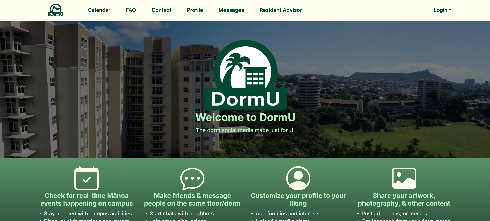
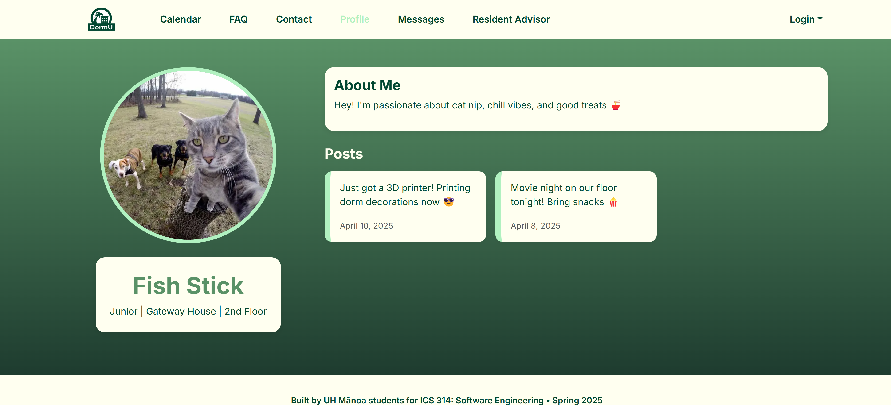
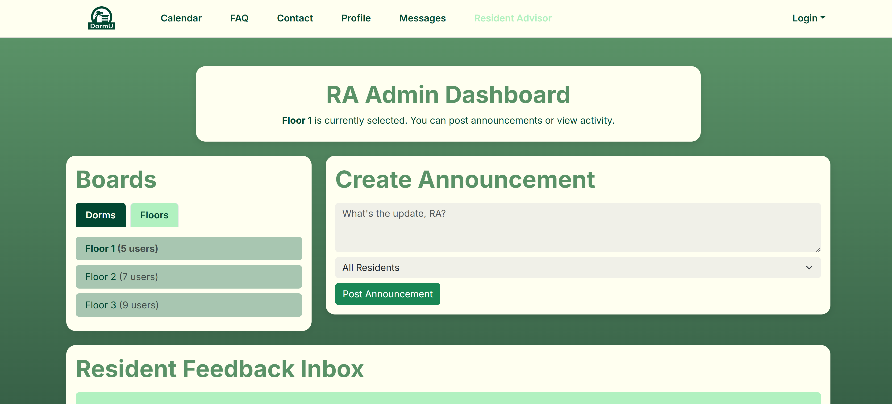
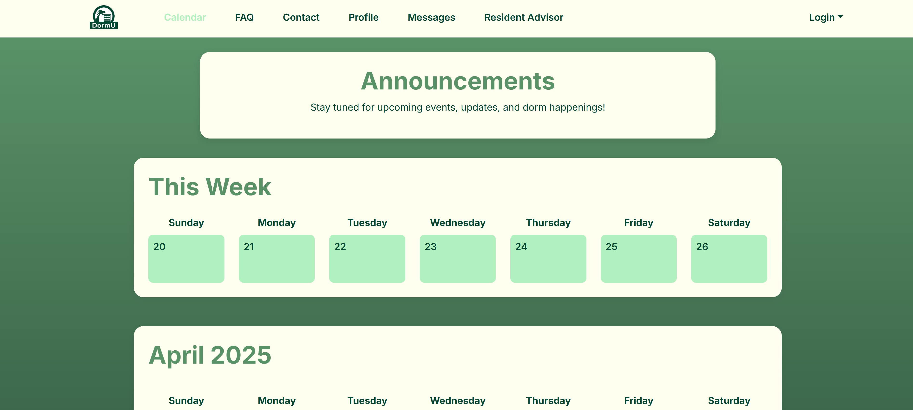
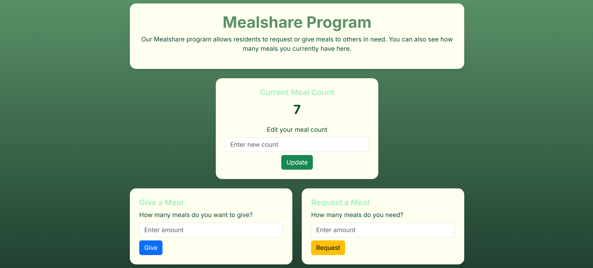
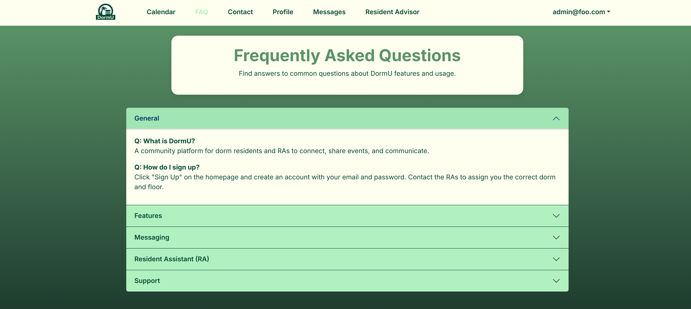

  

DormU is a social web application built for dormitory residents at the University of Hawaiʻi at Mānoa. This platform allows users to share meals, create events, and connect with others through a clean and modern interface. Developed as part of ICS 314, DormU helped me apply the skills I learned in a real-world development environment.

Built using:
- **Next.js** for the frontend
- **Prisma** and **PostgreSQL** for the backend
- **Tailwind CSS** for styling
- **Vercel** for deployment

Throughout the development, our team used GitHub Projects and Issues to structure our workflow. Although the final app didn’t include messaging or complete calendar syncing due to schema and time limitations, these features were outlined and planned through our Agile process.

🏆 DormU taught me how to:
- Collaborate in a real dev team
- Troubleshoot Vercel deployments
- Handle Prisma schema migration errors
- Prioritize user experience with a clean UI

---

### 📸 Screenshots

Here are some screenshots from the DormU application that I was responsible for designing:

**Landing Page**  

**Profile Page**  

**Resident Assistant (RA) Admin Panel**  

**Events Feed**  

**Meal Sharing Page**  

**Frequently Asked Questions (FAQ)**  

---

### Project Links

- 🔗 [Live Site](https://dorm-u-app.vercel.app/)
- 🐙 [GitHub Repository](https://github.com/dorm-u)
- 📄 [Project Homepage](https://dorm-u.github.io/)
