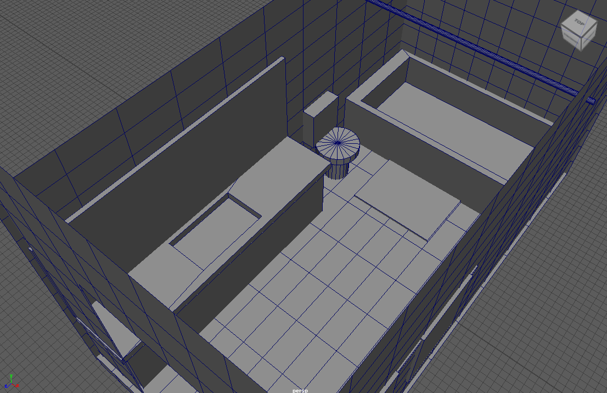
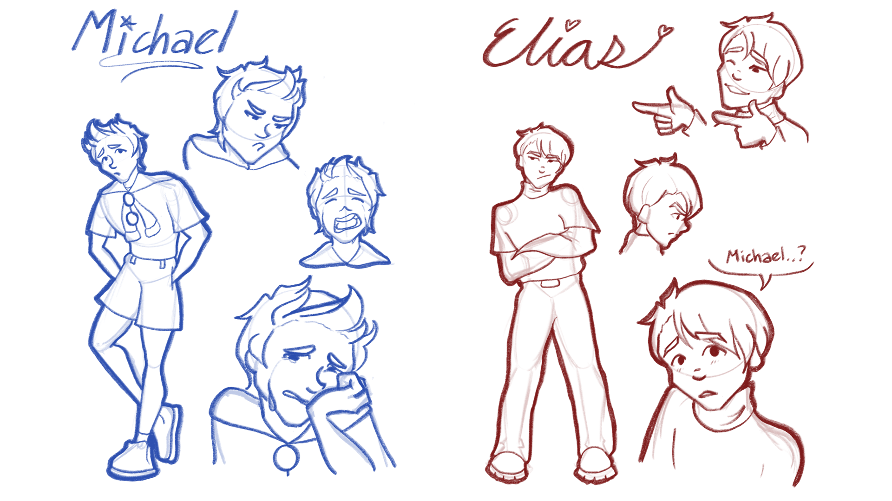

<video class="img-fluid" controls>
  <source src="../img/MITB/AnhNguyen_MV_Final_316C_F22.mp4" type="video/mp4">
  Your browser does not support the video tag.
</video>

"Michael In The Bathroom" is an animatic I made for my final project in ACM 316C, Intermediate Animation: 2D Animation. We were tasked with creating a music video with a 2 minute minimum and I decided to choose a song from one of my favorite musicals; Be More Chill.

Before drawing anything, I used Autodesk Maya to 3D model a base setting layout to trace for the backgrounds in order to keep consistency in different angles. Using the fundamentals of staging that this class taught, I was able to create an initial storyboard along with the music to produce this final product.

Bathroom Layout:

Original Character Designs:

