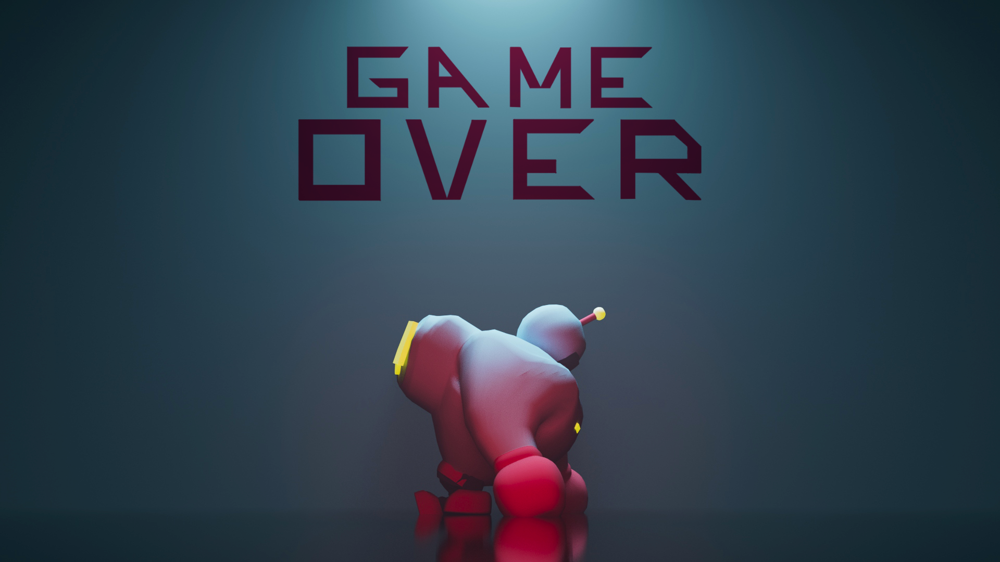
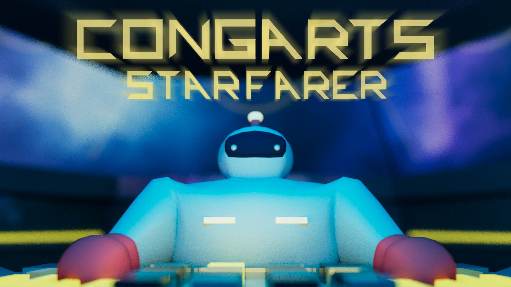

<video class="img-fluid" controls>
  <source src="../img/StarfarersAbyss/StarfarersAbyss-FinalVideo-Compressed.mp4" type="video/mp4">
  Your browser does not support the video tag.
</video>

“Starfarer's Abyss” was the final project for ICS 369, Computational Media Systems, a class where students were taught the basics of the Unity Game Engine and assigned to create a video game encompassing everything that was learned. It is an outerspace themed dungeon crawler where the player is contained in a 3D level, fights off enemy NPCs, and needs to explore to gain upgrades to escape.

My main task for this project was to design the map space in which the player navigates through, model said design, and fully texture everything. I also designed the main protagonist 3D model and created cutscene renders for the title screen, gameover screen, and victory screen.

Description:
You are the last survivor of your crew after the Glor aliens have hijacked your ship! Explore your ship and defeat the enemy aliens to gain items and upgrades, all while figuring out a way to get these aliens to leave your ship for good!

Game Instructions:
As humanity’s strongest soldier you are tasked with saving your ship...
1. Defeat aliens to collect weapon upgrades, keys, and teleporter scraps
2. Use the keys to unlock doors for health & armor upgrades
3. Once 3 teleporter scraps are collected, combine the teleporter scraps to enter the control room, fix the security system and save your ship!
Stay alive!

Map Layouts:
<video class="img-fluid" controls>
  <source src="../img/StarfarersAbyss/StarfarersAbyss-MapRotation.mp4" type="video/mp4">
  Your browser does not support the video tag.
</video>

<video class="img-fluid" controls>
  <source src="../img/StarfarersAbyss/StarfarersAbyss-ControlRotation.mp4" type="video/mp4">
  Your browser does not support the video tag.
</video>

Model Creation, Posing, & Image Rendering:

