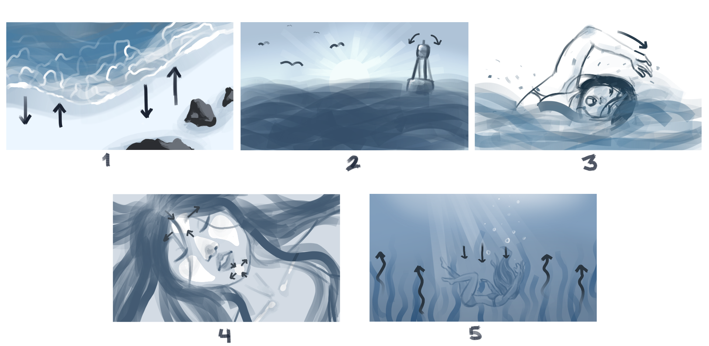

<video class="img-fluid" controls>
  <source src="../img/BSL/BelowSurfaceLevel-Final.mp4" type="video/mp4">
  Your browser does not support the video tag.
</video>

“Below Surface Level” is a PSA film I animated for my final project in my Introduction to 2D Animation class (CINE 216) and calls for action to be done about environmental related issues. The requirement for the final was to include at least 5 cycle (repeating) animations in the product in which you will see many repetative motions throughout the duration.

In the summer of 2022, this short film was awarded 1st place in Learning Endeavors' [Voices of Champions Film Competition](https://www.learningendeavors.org/voc) for the 16-21 age division with support from the Women's Fund of Hawaii.

This film was also submitted in the 2023 University of Hawaiʻi at Mānoa School of Cinematic Arts Awards which garned me the "Emerging Filmmaker Award."

Here are the initial storyboards from the pre-production stages of the project.

<pre>
Logline:
A Native Hawaiian girl comes to terms with her home drastically changing beyond recognition through humanity’s repeated cycles of creation and waste. 

Synopsis:
An unnamed Native Hawaiian girl goes out for a swim at her old beach. While reflecting on the world, she begins to narrate about the cycles of life on Earth.
Observing how nature continuously repeats itself, she yearns that humanity would one day learn how to heal itself and the planet before wreaking havoc on
other environments.
</pre>

Source:
